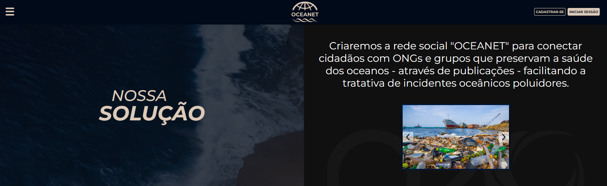

# INTEGRANTES:
- **[Kaique Rodrigues Zaffarani](https://github.com/Z4ffarani)**
- **[Guilherme Santos Nunes](https://github.com/sannunez)**
- **[Henry Evideira Paulo](https://github.com/Hep4xl0)**

 

# PROJETO
A **[O20](https://www.g20.org/pt-br/g20-social/grupos-de-engajamento/oceans-20#:~:text=Sobre%20o%20O20&text=A%20criação%20do%20Oceans20%20pela,é%20plural%20em%20suas%20características.)**, em parceria com o projeto **[Blue Future (FIAP)](https://www.fiap.com.br/graduacao/global-solution/)**, procura soluções inovadoras utilizando as novas tecnologias para promover o futuro sustentável dos oceanos. Com isso, decidimos elaborar um protótipo de site para apresentar uma hipotética rede social que facilitará a comunicação entre cidadãos comuns e atuadores de preservação da saúde dos oceanos, reduzindo o lixo disperso nas regiões litorâneas e oceânicas.

O projeto é composto por três páginas:

- **Home** | Página principal do site contendo os principais elementos visuais.
- **Registro** | Página dedicada para registro do usuário.
- **Login** | Página dedicada ao login do usuário.

 

# INSTRUÇÕES
Criar uma pasta no computador para ser o repositório local.

Abrir a pasta criada em uma IDE de preferência.

No terminal da IDE, clonar o repositório com `git clone https://github.com/Z4ffarani/Oceanet.git`

No terminal da IDE, navegar até a pasta do projeto com ``cd Oceanet``.

Acessar o site executando o arquivo ``index.html``.   

 

# FUNÇÕES

- **Registro e login de usuários** | Formulário de cadastro que armazena os dados do usuário (nome, email e senha), validação de senha com feedback visual para garantir que as senhas coincidem e autenticação simples no Login, utilizando a comparação das credenciais fornecidas com aquelas armazenadas temporariamente no navegador.
  
- **Carrossel de imagens** | Apresentação visual de slides com a possibilidade de navegação para os lados.

- **Menu de gaveta** | Menu lateral deslizante que pode ser aberto e fechado, facilitando a navegação no site.

 

# OBSERVAÇÕES
- O projeto utiliza ``sessionStorage`` para armazenar dados temporariamente. Isso significa que os dados são mantidos apenas enquanto a aba do navegador estiver aberta, sendo perdidos ao fechar o navegador ou recarregar a página. Para um sistema mais robusto de login, recomenda-se o uso de um banco de dados e autenticação segura.

- A validação básica de formulários foi implementada para o cadastro de usuários, mas é recomendado aprimorar a segurança com validação no backend e criptografia de senhas.

- A funcionalidade do Carrossel de imagens está programada para transitar entre os slides com um simples efeito de translação ``translateX``, ideal para sites estáticos. No entanto, é possível melhorar a experiência do usuário adicionando animações suaves e ``autoplay``.

- O Menu de gaveta pode ser melhorado para ter suporte a navegação mais complexa, como submenus ou integração com uma base de dados de páginas dinâmicas.

- Este projeto é apenas um protótipo voltado para testes e demonstrações. Em um ambiente de produção, recomenda-se o uso de tecnologias adicionais, como frameworks de Front-end, além de um servidor Back-end para gerenciar autenticação e armazenamento de dados de forma segura.

 

# TECNOLOGIAS
****
****
****

 

# REFERÊNCIAS
- **[Combate ao lixo no mar](https://www.marinha.mil.br/combate-ao-lixo-no-mar)**
- **[Como a poluição nos oceanos afeta nossa vida?](https://cestosdelixoelixeiras.com.br/blog-lixeiras/como-a-poluicao-nos-oceanos-afeta-nossa-vida)**
- **[Poluição dos oceanos: quais são as consequências para o planeta](https://umsoplaneta.globo.com/biodiversidade/noticia/2021/06/19/poluicao-dos-oceanos-quais-sao-as-consequencias-para-o-planeta.ghtml)**
